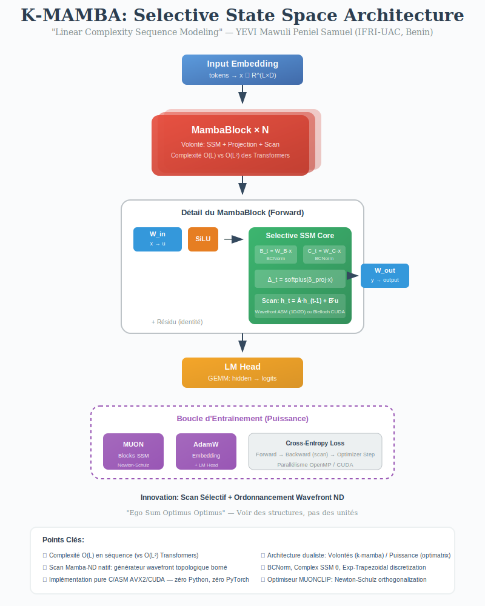

# optimus

Terrain d'entraînement et de test pour les modèles créés avec **k-mamba**.

Ce dépôt ne contient pas la bibliothèque elle-même. Il fournit deux instances
exécutables prêtes à l'emploi — l'une CPU, l'autre CUDA — construites au-dessus
de `k-mamba` pour entraîner, tester et utiliser des modèles de langage byte-level
de type Mamba SSM.

## K-Mamba: 
<p align="center">
  
</p>

---

## Structure

```
optimus/
├── k-mamba/        — bibliothèque k-mamba (submodule git)
│                     State Space Models Mamba en C/ASM AVX2
├── cpu/            — instance CPU pure (AVX2)
│   ├── main.c      — train / gen / chat
│   ├── test_scan.c — diagnostic scan1d ASM
│   ├── test_grad.c — diagnostic backward pass
│   └── README.md
├── cuda/           — instance CPU+CUDA (optimizer steps sur GPU)
│   ├── main.c      — train / gen / chat
│   └── README.md
└── README.md       — ce fichier
```

---

## Instances disponibles

### `cpu/` — CPU pur (AVX2)

Modèle plus grand, entièrement sur CPU. Recommandé pour :
- Machines sans GPU NVIDIA
- Débogage et profiling (pas de synchronisation GPU)
- Entraînement long sur serveur sans GPU

Configuration par défaut : `DIM=512`, `STATE_SIZE=1024`, `N_LAYERS=4`.
Empreinte : ~119 MB RAM.

Voir [`cpu/README.md`](cpu/README.md) pour les détails.

### `cuda/` — Hybride CPU+CUDA (MX450 / sm_75+)

Forward/backward sur CPU (scan ASM AVX2). Optimizer steps (MUON, AdamW, gradient
clipping) déchargés sur GPU. Recommandé pour :
- Machines avec GPU NVIDIA (même entrée de gamme)
- Accélérer les mises à jour de paramètres sur grands batches

Configuration par défaut : `DIM=128`, `STATE_SIZE=256`, `N_LAYERS=2`.
Empreinte : ~30 MB RAM + ~15 MB VRAM.

Voir [`cuda/README.md`](cuda/README.md) pour les détails.

---

## Démarrage rapide

### Build CPU

```bash
cd cpu
cmake -B build -DCMAKE_BUILD_TYPE=Release
cmake --build build -j$(nproc)
```

### Build CUDA

```bash
cd cuda
cmake -B build -DCMAKE_BUILD_TYPE=Release
cmake --build build -j$(nproc)
```

### Entraîner

```bash
# CPU
./cpu/build/kmamba_cpu train data/corpus.txt ckpt_cpu.bin

# CUDA
./cuda/build/kmamba_cuda train data/corpus.txt ckpt_cuda.bin
```

### Générer

```bash
./cpu/build/kmamba_cpu  gen ckpt_cpu.bin  "Il était une fois"
./cuda/build/kmamba_cuda gen ckpt_cuda.bin "Il était une fois"
```

### Chat interactif

```bash
./cpu/build/kmamba_cpu  chat ckpt_cpu.bin
./cuda/build/kmamba_cuda chat ckpt_cuda.bin
```

---

## Compatibilité des checkpoints

Les fichiers `.bin` produits par l'instance CPU et l'instance CUDA sont
interchangeables — même format binaire, même `KMambaConfig`. Un modèle pré-entraîné
sur CPU peut être repris sur CUDA et inversement, à condition que les hyperparamètres
(`DIM`, `STATE_SIZE`, `N_LAYERS`, `SEQ_LEN`) soient identiques entre les deux `main.c`.

---

## Prérequis communs

- x86-64 avec AVX2
- GCC >= 9, NASM >= 2.14, CMake >= 3.18
- Pour CUDA : CUDA Toolkit >= 11.0, GPU sm_75+

---

## Bibliothèque sous-jacente

`k-mamba` (submodule `k-mamba/`) fournit :
- L'API du modèle (`kmamba.h`) : création, init, forward, backward, checkpoint
- Les kernels de calcul : GEMM/GEMV AVX2, scan1d/2d ASM, ConvND, activations
- Les optimiseurs : MUON (Newton-Schulz 5 itérations) + AdamW (CPU et CUDA)

Voir [`k-mamba/README.md`](k-mamba/README.md) pour l'API complète et l'architecture.
